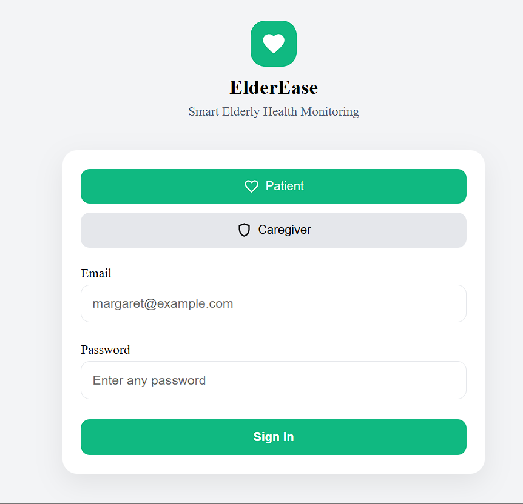
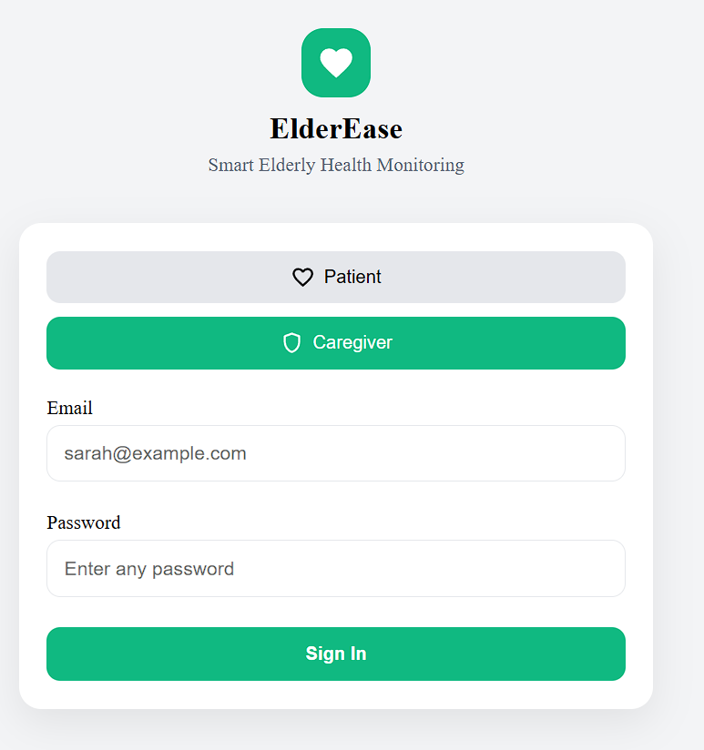
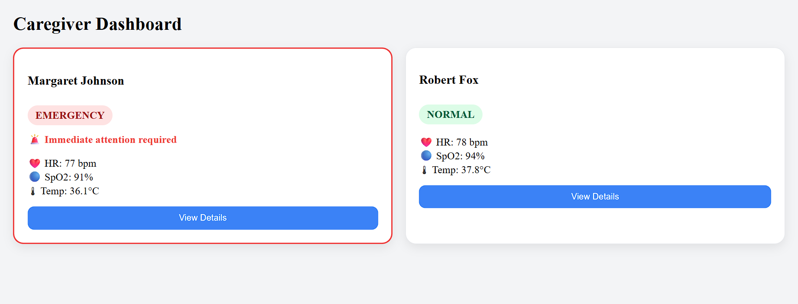
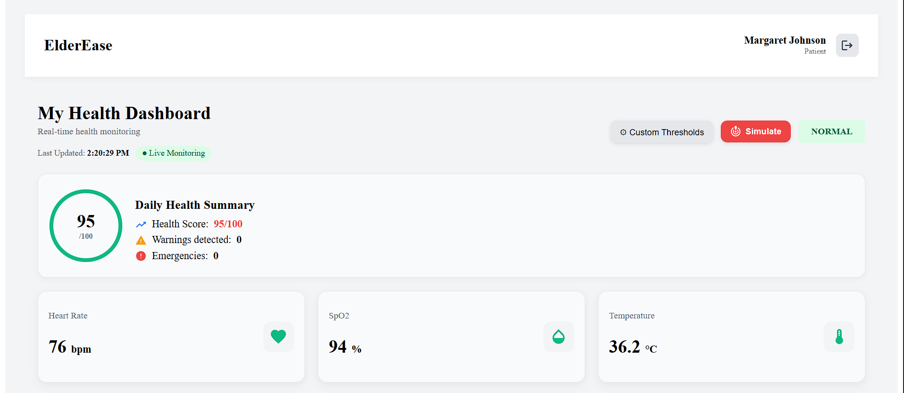
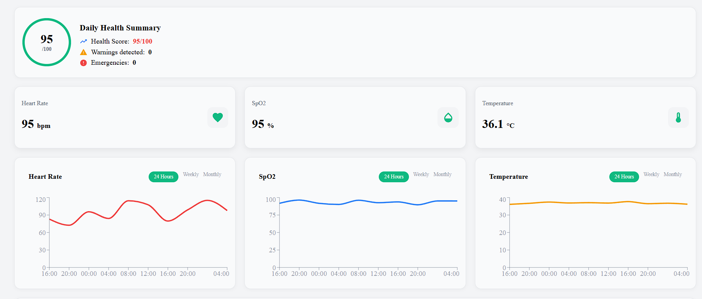
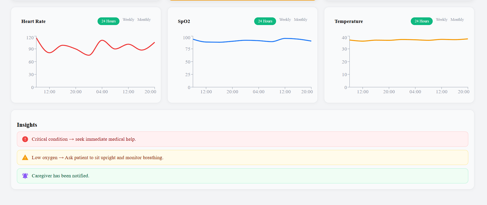
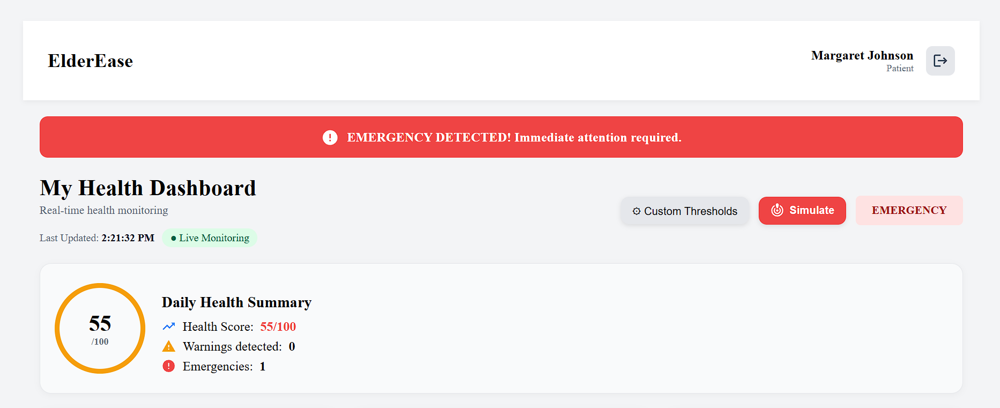
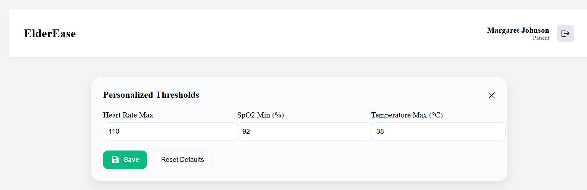
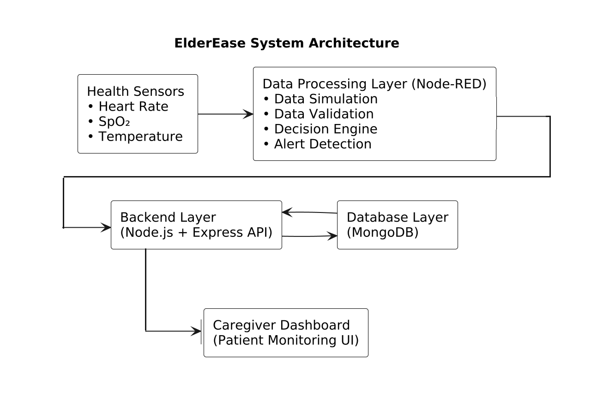

# 💖 ElderEase – Intelligent Senior Health Monitoring System

> Real-time IoT-based elderly health monitoring with proactive alerts and caregiver support.


---

# 📄 Abstract

ElderEase is an intelligent IoT-based health monitoring system designed to provide real-time tracking and proactive care for elderly individuals.

Phase 1 establishes a rule-based monitoring architecture using Node-RED, enabling structured health data simulation, validation, classification, and logging.  

The system follows an event-driven, flow-based design and is built entirely using open-source technologies to ensure FOSS compliance.  

This phase serves as the foundational layer for future expansions including database integration, full-stack web dashboards, and machine learning-based predictive analytics.

---

# 🎯 Problem Statement

Elderly individuals living independently face significant health risks such as:

- Sudden heart rate spikes  
- Low oxygen saturation  
- Fever episodes  
- Lack of continuous monitoring  

Most existing systems are reactive and hardware-dependent. ElderEase aims to create a scalable monitoring architecture starting with a simulated real-time pipeline.

---

# 🚀 Current Features

### 👩‍⚕️ For Caregivers
- View all patients in a centralized dashboard  
- Select a patient and monitor their health instantly  
- Real-time health status: **NORMAL / WARNING / EMERGENCY**  
- Instant alerts for abnormal health conditions

### 🧓 For Patients
- Live health monitoring dashboard  
- Real-time vitals:
  - ❤️ Heart Rate  
  - 🫁 SpO₂  
  - 🌡 Temperature  
- Health score and daily summary  
- Smart health insights and recommendations

### 📊 Smart Monitoring
- Real-time data simulation (auto-updating)  
- Live charts for vitals trends  
- Trend detection (increasing / decreasing patterns)  
- Emergency simulation for testing  

### ⚙️ Customization
- Set personalized health thresholds  
- Dynamic alerts based on user-specific limits  

### 📱 UI/UX
- Fully responsive (mobile + desktop)  
- Clean and intuitive dashboard design  
- Interactive components and alerts  

---

# 🎥 Demo

🚀 **Live Demo:**  
👉 [Visit the ElderEase App](https://elder-ease-rose.vercel.app/)

📹 **Demo Video:** Coming Soon!

---

### Demo Flow
1. Open caregiver dashboard  
2. Select a patient  
3. View real-time vitals  
4. Observe alerts & risk score  
5. Simulate emergency  
6. Customize thresholds  

---

# 📸 Product Screenshots

## 🔐 Authentication System

### 👤 Patient Login


A simple and intuitive login interface for patients.  
Users can securely access their personal health dashboard with role-based authentication.

---

### 🛡️ Caregiver Login


Dedicated login for caregivers, enabling access to multiple patient profiles and real-time monitoring capabilities.

---

## 👩‍⚕️ Caregiver Dashboard



Provides a centralized view for caregivers to monitor multiple patients in real-time.

- Displays a list of all patients with their current health status  
- Color-coded indicators for **NORMAL / WARNING / EMERGENCY** conditions  
- Quick overview of each patient’s vitals and risk level  
- Enables seamless navigation to individual patient dashboards  
- Designed for efficient monitoring and faster decision-making  

---

## 🧓 Patient Dashboard

### ✅ Normal Health State


- Displays real-time vital signs  
- Shows overall health score and daily summary  
- Indicates stable condition (**NORMAL**)  
- Provides live monitoring with last updated timestamp  

---

## 📊 Real-Time Health Monitoring

### 📈 Vital Trends Dashboard


Displays real-time trends of key health parameters:

- ❤️ Heart Rate  
- 🫁 SpO₂  
- 🌡 Temperature  

Supports 24-hour visualization with scalable weekly/monthly views for future expansion.

---

## 🧠 Smart Insights & Alerts

### 🚨 Health Insights Panel


Provides intelligent health insights and actionable recommendations:

- 🔴 Critical alerts for emergency conditions  
- 🟡 Warning indicators for abnormal vitals  
- 🟢 Informational updates for caregivers  

Enhances decision-making and enables early intervention.

---

## 🚨 Emergency Detection

### ⚠️ Emergency State Dashboard


- Prominent emergency alert banner for critical conditions  
- Real-time detection of abnormal health parameters  
- Updated risk score and alert indicators  
- Enables immediate caregiver response  

---

## ⚙️ Customization & Controls

### 🎛️ Thresholds & Simulation


- Customize health thresholds for personalized monitoring  
- Simulate emergency scenarios for testing system behavior  
- Helps validate alert mechanisms and system responsiveness  

---

# 🏗️ System Architecture 



    ### ⚙️ System Overview

ElderEase is designed as a **real-time IoT-based health monitoring system** that enables continuous tracking of elderly patients.

This architecture represents a scalable, real-world deployment of ElderEase with IoT integration.

### 🔄 System Workflow

1. **Health Sensors**
   - Wearable sensors capture vital parameters:
     - Heart Rate  
     - SpO₂  
     - Temperature  

2. **IoT Microcontroller**
   - ESP32 collects and processes sensor data  
   - Prepares data for transmission  

3. **Wireless Communication**
   - Data is transmitted via Wi-Fi using HTTP APIs  

4. **Backend Processing**
   - Node.js + Express processes incoming data  
   - Applies health logic and risk evaluation  

5. **Data Storage**
   - MongoDB stores patient health records  
   - Enables historical tracking and analytics  

6. **Monitoring Dashboard**
   - Caregivers can:
     - View patient vitals in real-time  
     - Receive alerts  
     - Monitor trends and risk scores  

7. **AI Insights Layer**
   - Generates health insights and recommendations  
   - Provides predictive risk scoring  

---

⚠ **Implementation Note**

The system is fully designed for real IoT hardware integration.

Currently, the prototype uses **Node-RED-based simulation** to generate real-time health data, allowing:
- Rapid development and testing  
- Validation of system behavior  
- Demonstration without physical hardware  

The architecture is ready for direct integration with real sensors in future phases.

---

# 🛠️ Tech Stack
```
| Layer           |             Technology               |           Purpose                     |
|-----------------|--------------------------------------|---------------------------------------|
| Runtime         |             Node.js                  | Runs Node-RED and backend services    |
| Core Engine     |               Node-RED               | Flow-based health data simulation     |
| Backend         |         Express.js                   | API layer for system integration      |
| Programming     |          JavaScript                  | System logic implementation           |
| Data Format     |                  JSON                | Structured health data exchange       |
| Database        |         MongoDB (Phase 3)            | Persistent health record storage      |
| UI              | Node-RED Dashboard / React (Phase 4) | Monitoring interface                  |
| Version Control |             Git + GitHub             | Project version management            |
```

---

# 👥 Project Members & Responsibilities

ElderEase is developed collaboratively with clear module ownership aligned with the system architecture.

---

## 🔹 Aadya Patel  
Role: Frontend & AI/ML Lead  

Primary Responsibilities
- Design system architecture
- Develop frontend monitoring dashboard
- Implement data visualization components
- Design AI/ML health prediction models (future phase)

---

## 🔹 Ananya Mishra  
Role: Database & Monitoring Systems Lead  

Primary Responsibilities
- Design MongoDB database schema
- Implement persistent health data storage
- Manage monitoring and logging infrastructure

---

## 🔹 Anish Kushwaha  
Role: Backend & API Systems Lead  

Primary Responsibilities
- Develop backend APIs using Node.js + Express
- Implement system communication between modules
- Manage API endpoints for dashboard data retrieval

---

## 🤝 Collaboration Model

- Each module is developed independently but integrated through structured JSON payloads.
- Weekly reviews ensure architectural consistency.
- All members contribute commits regularly following conventional commit standards.

---


# 🚀 Development Roadmap

### Phase 1 — Monitoring Prototype
• Vital data simulation  
• Data validation  
• Decision engine  
• Monitoring and logging  
• Basic dashboard  

### Phase 2 — Backend Infrastructure
• Node.js + Express APIs  
• Data processing endpoints  
• API-based system architecture  

### Phase 3 — Database Integration
• MongoDB health records  
• Persistent monitoring data  
• Historical health analytics  

### Phase 4 — Advanced Frontend
• React-based dashboard  
• Authentication system  
• Role-based access control  

### Phase 5 — AI/ML Intelligence
• Anomaly detection models  
• Predictive health risk scoring  
• Early warning analytics  

### Phase 6 — IoT Hardware Integration (Future)
• Real health sensors  
• ESP32 IoT device  
• Remote physiological monitoring

---

## 🔐 FOSS Compliance

- No proprietary APIs
- No paid services
- Fully local execution
- Built entirely on open-source technologies

---

# 📜 License

This project is licensed under the **MIT License**.

---

## 🌱 Future Vision

ElderEase aims to evolve into a predictive, scalable elderly healthcare monitoring ecosystem integrating IoT, full-stack architecture, and machine learning.

---

## 🔬 Research Direction

ElderEase is designed as a scalable healthcare monitoring architecture that can evolve from a simulation-based prototype into a full IoT-enabled intelligent monitoring platform integrating real sensors, backend infrastructure, and machine learning models.

---

## 💬 Final Note

“Because every heartbeat deserves timely care.” ❤️🌸
