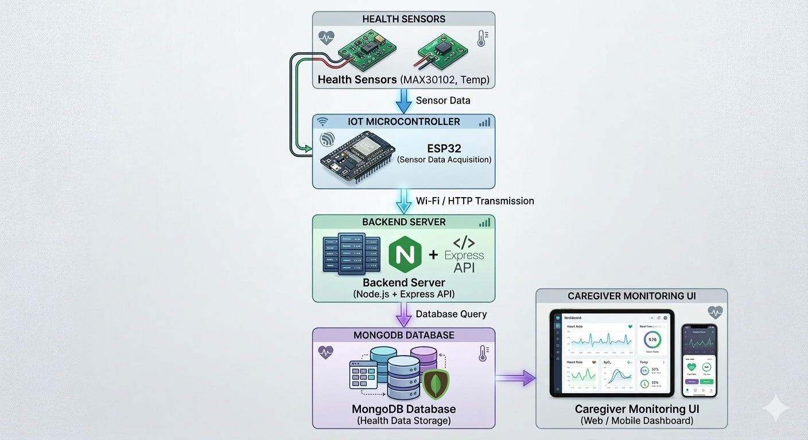

# 💖 ElderEase – Intelligent Senior Health Monitoring System


---

# 📄 Abstract

ElderEase is a modular, real-time health monitoring system designed to simulate and analyze vital health parameters of elderly individuals.  

Phase 1 establishes a rule-based monitoring architecture using Node-RED, enabling structured health data simulation, validation, classification, and logging.  

The system follows an event-driven, flow-based design and is built entirely using open-source technologies to ensure FOSS compliance.  

This phase serves as the foundational layer for future expansions including database integration, full-stack web dashboards, and machine learning-based predictive analytics.

---

# 🎯 Problem Statement

Elderly individuals living independently face significant health risks such as:

- Sudden heart rate spikes  
- Low oxygen saturation  
- Fever episodes  
- Lack of continuous monitoring  

Most existing systems are reactive and hardware-dependent. ElderEase aims to create a scalable monitoring architecture starting with a simulated real-time pipeline.

---

# 🏗️ System Architecture 

```
                ┌────────────────────────────┐
                │ Vital Data Generation      │
                │ (Node-RED Simulation)      │
                │ Phase 1                    │
                └─────────────┬──────────────┘
                              │
                              ▼
                ┌────────────────────────────┐
                │ Data Validation Module     │
                │ Physiological Range Check  │
                │ Phase 1                    │
                └─────────────┬──────────────┘
                              │
                              ▼
                ┌────────────────────────────┐
                │ Decision Engine            │
                │ Rule-Based Health Status   │
                │ Phase 1                    │
                └─────────────┬──────────────┘
                              │
                              ▼
                ┌────────────────────────────┐
                │ Backend API Layer          │
                │ Node.js + Express          │
                │ Phase 2                    │
                └─────────────┬──────────────┘
                              │
                              ▼
                ┌────────────────────────────┐
                │ Database Layer             │
                │ MongoDB Health Records     │
                │ Phase 3                    │
                └─────────────┬──────────────┘
                              │
                              ▼
                ┌────────────────────────────┐
                │ Frontend Monitoring UI     │
                │ Web Dashboard (React)      │
                │ Phase 4                    │
                └─────────────┬──────────────┘
                              │
                              ▼
                ┌────────────────────────────┐
                │ AI / ML Health Analytics   │
                │ Anomaly Detection          │
                │ Predictive Health Scoring  │
                │ Phase 5                    │
                └─────────────┬──────────────┘
                              │
                              ▼
                ┌────────────────────────────┐
                │ Future IoT Hardware Layer  │
                │ Sensors + ESP32            │
                │ (Future Extension)         │
                └────────────────────────────┘
```

The following layered architecture illustrates both the current prototype (Phase 1) and the planned scalable system evolution across future development phases.

### Architecture Characteristics:

- Event-driven system
- Flow-based processing using Node-RED
- API-driven backend architecture
- Modular layered design
- Scalable for AI-based analytics
- Designed for future IoT sensor integration

### 📊 System Architecture Diagram
The following diagram illustrates the complete scalable architecture of the ElderEase monitoring system.



### System Workflow

## 🔄 Current Prototype Workflow (Phase 1)

### 1️⃣ Vital Data Simulation
- Node-RED generates simulated health data  
- Includes heart rate, SpO₂, and temperature readings  

### 2️⃣ Data Validation
- Physiological range checks ensure data reliability  
- Prevents unrealistic sensor values from entering the system  

### 3️⃣ Decision Engine
- Rule-based health classification  
- Determines **NORMAL / WARNING / EMERGENCY** health states  

### 4️⃣ Monitoring & Logging
- Tracks system metrics and emergency events  
- Maintains runtime monitoring statistics  

### 5️⃣ Dashboard Visualization
- Displays real-time health data using the **Node-RED dashboard**  
- Provides live monitoring of patient vitals

---

## 🔄 Future IoT Workflow (Planned Extension) 

1. **Health Sensors**
   - MAX30102 sensor measures heart rate and SpO₂
   - Temperature sensor measures body temperature

2. **IoT Microcontroller**
   - ESP32 collects sensor readings
   - Handles data acquisition and preprocessing

3. **Wireless Data Transmission**
   - Sensor readings are transmitted via Wi-Fi using HTTP APIs

4. **Backend Server**
   - Node.js + Express processes incoming health data
   - Performs system-level health analysis

5. **Database Storage**
   - MongoDB stores patient health records
   - Enables historical health analytics

6. **Caregiver Monitoring Dashboard**
   - Displays real-time patient health metrics
   - Generates alerts for abnormal conditions

---

⚠ **Note:**  
The current Phase 1 prototype uses simulated health data through Node-RED.  
The IoT hardware layer shown in the architecture diagram represents a **future system extension** and is not part of the current prototype implementation.

---

## 🧩 Future IoT Hardware Integration (Proposed)

Although Phase 1 uses simulated health data through Node-RED, the architecture is designed to support integration with real IoT health sensors in future phases.

### Proposed Hardware Pipeline

```
          Health Sensors  
          (MAX30102 – Heart Rate & SpO₂  
          Temperature Sensor)

                  ↓

          ESP32 / NodeMCU  
          IoT Microcontroller

                  ↓

          WiFi / HTTP Transmission

                  ↓

          Backend API Server  
          (Node.js + Express)

                  ↓

          MongoDB Database

                  ↓

          Caregiver Monitoring Dashboard
```

### Design Objective

The hardware integration layer will enable:

- Real-time physiological data acquisition
- Wireless transmission of vital health data
- Integration with backend health analytics systems
- Remote caregiver monitoring

Hardware integration is planned as a **future system extension** and is not part of the current prototype implementation.

---

# 🛠️ Tech Stack
```
| Layer           |             Technology               |           Purpose                     |
|-----------------|--------------------------------------|---------------------------------------|
| Runtime         |             Node.js                  | Runs Node-RED and backend services    |
| Core Engine     |               Node-RED               | Flow-based health data simulation     |
| Backend         |         Express.js                   | API layer for system integration      |
| Programming     |          JavaScript                  | System logic implementation           |
| Data Format     |                  JSON                | Structured health data exchange       |
| Database        |         MongoDB (Phase 3)            | Persistent health record storage      |
| UI              | Node-RED Dashboard / React (Phase 4) | Monitoring interface                  |
| Version Control |             Git + GitHub             | Project version management            |
```
---

## 🔧 Node-RED Setup

1. Install Node.js (v18+ recommended)
2. Install Node-RED:
   npm install -g --unsafe-perm node-red
3. Start Node-RED:
   node-red
4. Open: http://localhost:1880

### 📸 Node-RED Welcome Screen


### 📸 Node-RED Editor Interface


---
# 📦 Module Breakdown

---

## 🔹 1. Vital Data Simulation Module

Simulates real-time wearable sensor data.

Generated Fields:

- `userId`
- `deviceId`
- `heartRate`
- `spo2`
- `temperature`
- `timestamp`
- `systemVersion`

Example Output:

```
{
  "userId": "ELD001",
  "deviceId": "SIM001",
  "heartRate": 87,
  "spo2": 96,
  "temperature": 36.8,
  "timestamp": "2026-03-01T14:00:00",
  "systemVersion": "v1.0"
}
```

### 📸 Live Simulation Output

The following screenshot shows real-time vital data being generated every 5 seconds using the simulation module.


---

## 🔹 2. Data Validation Module

The **Data Validation Module** ensures that all simulated health readings fall within realistic physiological ranges before further processing.

### Validation Ranges

- **Heart Rate:** 40–180 bpm  
- **SpO₂:** 70–100 %  
- **Temperature:** 34–42 °C  

### Functionality

- Verifies each incoming reading.
- Flags invalid or out-of-range values.
- Logs invalid readings for monitoring.
- Appends `valid` and `error` fields.
- Preserves structured payload integrity.
- Prevents corrupted data from entering the decision engine.

### Example (Invalid Flagged Output)

```
{
  "heartRate": 220,
  "spo2": 95,
  "temperature": 36.9,
  "valid": false,
  "error": "Heart Rate out of realistic range"
}
```

📸 Live Validation Output


---

## 🔹 3. Decision Engine Module

The **Decision Engine Module** performs rule-based classification of validated health readings.

It analyzes processed data and determines the real-time health status of the monitored individual.

---

### 📊 Status Categories

- NORMAL
- WARNING
- EMERGENCY

---

### ⚙️ Rule Logic (Phase 1)

- heartRate > 110 → EMERGENCY
- spo2 < 90 → EMERGENCY
- temperature > 38°C → EMERGENCY
- Borderline conditions → WARNING
- Otherwise → NORMAL

---

### 🧠 Decision Output Structure

```json
{
  "status": "EMERGENCY",
  "reason": "Low Oxygen Level",
  "riskLevel": 3,
  "timestamp": "2026-03-01T14:00:00"
}
```

### 🚦 Risk Level Mapping

| Risk Level | Status |
|------------|---------|
| 1 | NORMAL |
| 2 | WARNING |
| 3 | EMERGENCY |

---

### 🔮 Design Advantages

- Clear separation of validation and classification logic
- Easy rule modification
- Expandable to ML-based prediction models
- Compatible with database persistence in Phase 2

📸 Decision Engine Output


---

## 🔹 4. Monitoring & Logging Module

The **Monitoring & Logging Module** enhances system transparency, reliability, and observability.

It tracks system-level metrics and emergency events for operational monitoring.

---

### 📈 Metrics Tracked

- Total readings processed
- Emergency event count
- Last emergency timestamp
- Recent reading history (last N records)

---

### 💾 Storage Mechanism

- Uses Node-RED flow/global context storage
- Maintains temporary in-memory logs
- No external database dependency (Phase 1)
- Structured for future database integration

---

### 📝 Example Logged Record

```json
{
  "timestamp": "2026-03-01T14:00:00",
  "status": "EMERGENCY",
  "reason": "High Heart Rate",
  "riskLevel": 3
}
```

---

### ✅ Architectural Benefits

- Improves system reliability
- Enables audit-style monitoring
- Makes prototype production-ready
- Simplifies transition to persistent storage

---

## 🔹 5. Manual Emergency Injection

Testing capability for controlled demo scenarios.

### 🎯 Supported Simulations

- Simulate High Heart Rate
- Simulate Low SpO₂
- Simulate Fever

Allows controlled validation of the Decision Engine and edge-case testing without modifying core simulation logic.

### 📸 Manual Emergency Simulation
Manual injection nodes allow testing emergency conditions instantly.


---

## 🔹 6. Real-Time Dashboard Module

The **Dashboard Module** provides live visualization of simulated health data using `node-red-dashboard`.

It operates as a dedicated UI layer, separated from core simulation and decision logic.

### 🖥️ Dashboard Features

* Real-time **Heart Rate Gauge**
* Real-time **SpO₂ Gauge**
* Real-time **Temperature Gauge**
* **Color-coded Health Status Indicator**
* **Emergency Alert Display**
* **Daily Health Summary Counter**
* **Live Heart Rate Monitoring Chart**
* **Manual Emergency Simulation Controls**

### 🔄 Data Flow for Dashboard

```
Vital Simulation Module
↓
Extract Heart Rate Function
↓
Heart Rate Gauge (UI)
```

### 📸 Live Dashboard Output
The screenshot below demonstrates the real-time dashboard updating dynamically based on simulated vital data.


### 📸 Vital Monitoring Dashboard
The dashboard displays real-time vital health parameters through interactive gauges.


---

## 🔹 7. Emergency Alert Module

The **Emergency Alert Module** detects abnormal health conditions classified by the Decision Engine and generates visual alerts on the monitoring dashboard.

### Features

* Detects **EMERGENCY** health states
* Displays alert messages with vital details
* Enables rapid identification of critical conditions
* Designed for future integration with notification services

### Example Alert

```
⚠ EMERGENCY DETECTED
HR: 121 | SpO₂: 86 | Temp: 37.3
```

### 📸 Emergency Alert Display
The dashboard immediately highlights critical health events when abnormal vitals are detected.


---

## 🔹 8. Daily Health Summary Module

Tracks system activity and health events during runtime.

### Metrics Displayed

* Total warnings detected
* Total emergency events
* Continuous monitoring statistics

### Example Summary

```
Warnings Today: 87
Emergencies Today: 212
```

---

## 📊 JSON Schema (Phase 1)

```json
{
  "userId": "string",
  "deviceId": "string",
  "heartRate": "number",
  "spo2": "number",
  "temperature": "number",
  "status": "string",
  "reason": "string",
  "riskLevel": "number",
  "timestamp": "ISO Date",
  "systemVersion": "string"
}
```

Designed with structured extensibility for database persistence and ML-based analytics in future phases.

### 📸 Daily Health Monitoring Summary
The system tracks warning and emergency events during runtime.


---

## 🔹 9. Live Vital Monitoring Chart

A **real-time line chart** visualizes heart rate fluctuations over time.

### Capabilities

* Displays last N heart rate readings
* Updates automatically every 5 seconds
* Provides trend visualization for patient monitoring

### Example Visualization

```
Heart Rate Trend Over Time
```

### 📸 Live Heart Rate Monitoring Chart
The chart visualizes heart rate trends over time for continuous monitoring.


--- 

## 🧪 Testing Strategy

| Test Case | Input | Expected Output |
|------------|--------|----------------|
| Normal HR | 85 bpm | NORMAL |
| High HR | 125 bpm | EMERGENCY |
| Low SpO₂ | 82 % | EMERGENCY |
| High Temp | 39 °C | EMERGENCY |

Manual inject nodes validate all boundary and emergency conditions.

---

# 👥 Project Members & Responsibilities

ElderEase is developed collaboratively with clear module ownership aligned with the system architecture.

---

## 🔹 Aadya Patel  
Role: Frontend & AI/ML Lead  

Primary Responsibilities
- Design system architecture
- Develop frontend monitoring dashboard
- Implement data visualization components
- Design AI/ML health prediction models (future phase)

---

## 🔹 Ananya Mishra  
Role: Database & Monitoring Systems Lead  

Primary Responsibilities
- Design MongoDB database schema
- Implement persistent health data storage
- Manage monitoring and logging infrastructure

---

## 🔹 Anish Kushwaha  
Role: Backend & API Systems Lead  

Primary Responsibilities
- Develop backend APIs using Node.js + Express
- Implement system communication between modules
- Manage API endpoints for dashboard data retrieval

---

## 🤝 Collaboration Model

- Each module is developed independently but integrated through structured JSON payloads.
- Weekly reviews ensure architectural consistency.
- All members contribute commits regularly following conventional commit standards.

---

# 🚀 Development Roadmap

### Phase 1 — Monitoring Prototype
• Vital data simulation  
• Data validation  
• Decision engine  
• Monitoring and logging  
• Basic dashboard  

### Phase 2 — Backend Infrastructure
• Node.js + Express APIs  
• Data processing endpoints  
• API-based system architecture  

### Phase 3 — Database Integration
• MongoDB health records  
• Persistent monitoring data  
• Historical health analytics  

### Phase 4 — Advanced Frontend
• React-based dashboard  
• Authentication system  
• Role-based access control  

### Phase 5 — AI/ML Intelligence
• Anomaly detection models  
• Predictive health risk scoring  
• Early warning analytics  

### Phase 6 — IoT Hardware Integration (Future)
• Real health sensors  
• ESP32 IoT device  
• Remote physiological monitoring

---

## 📈 Weekly Progress Tracking

### Week 1 (Completed)

```
✔ Implemented real-time vital simulation module  
✔ Added structured JSON payload with ISO timestamp  
✔ Configured 5-second automated data trigger  
✔ Integrated Node-RED dashboard for live visualization  
✔ Implemented Extract Heart Rate UI processing layer  
✔ Deployed real-time heart rate gauge interface  
```

### Week 2 (Completed)

```
✔ Implemented multi-vital dashboard with gauges
✔ Added SpO₂ and Temperature monitoring visualization
✔ Implemented color-coded health status indicator
✔ Built emergency alert detection and display system
✔ Added daily health summary counter
✔ Implemented manual emergency simulation controls
✔ Integrated live heart rate monitoring chart
✔ Refactored dashboard architecture for modular UI components
```

---

## 🔐 FOSS Compliance

- No proprietary APIs
- No paid services
- Fully local execution
- Built entirely on open-source technologies

---

# 📜 License

This project is licensed under the **MIT License**.

---
## 🌱 Future Vision

ElderEase aims to evolve into a predictive, scalable elderly healthcare monitoring ecosystem integrating IoT, full-stack architecture, and machine learning.

---

## 🔬 Research Direction

ElderEase is designed as a scalable healthcare monitoring architecture that can evolve from a simulation-based prototype into a full IoT-enabled intelligent monitoring platform integrating real sensors, backend infrastructure, and machine learning models.

---

## 💬 Final Note

“Because every heartbeat deserves timely care.” ❤️🌸
