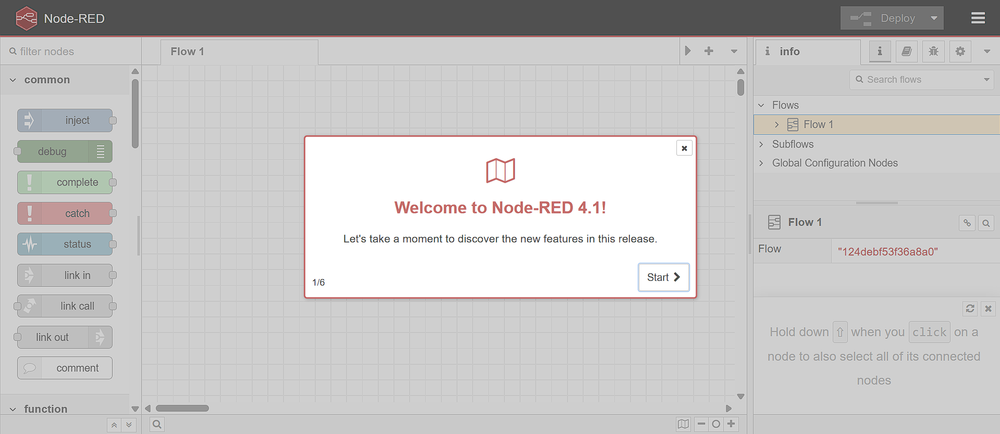
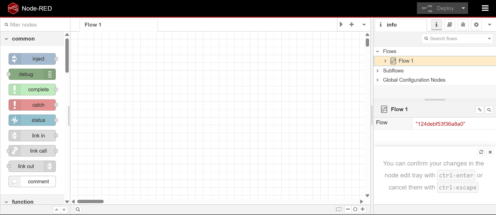
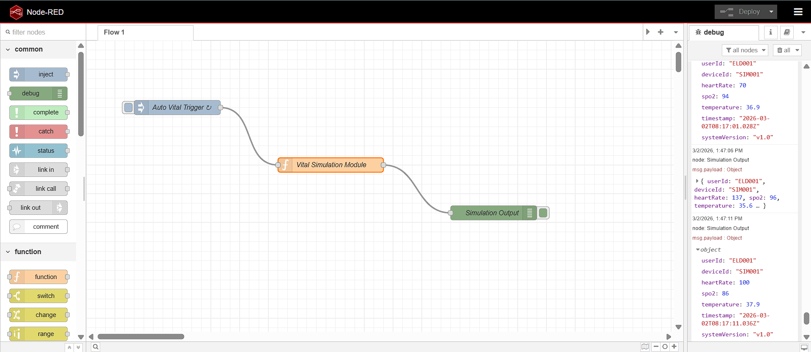
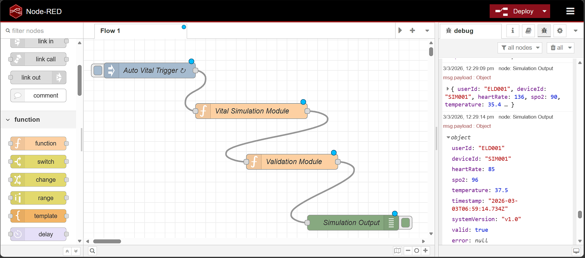
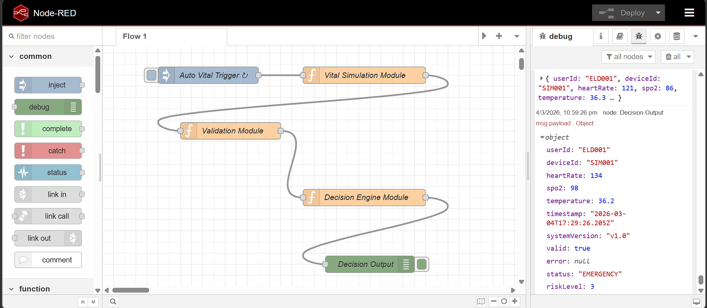
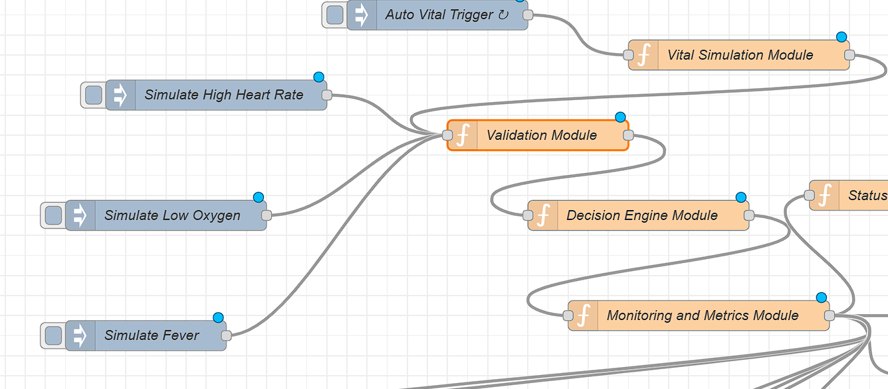
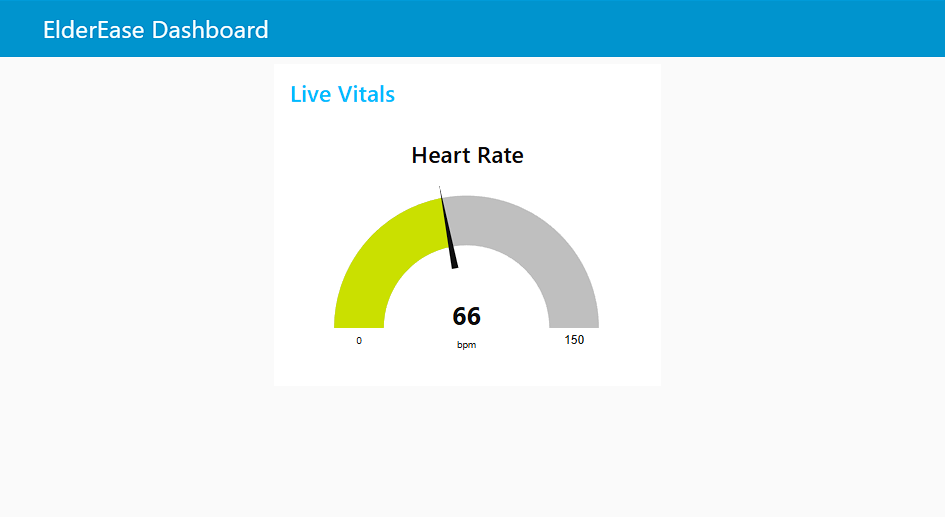
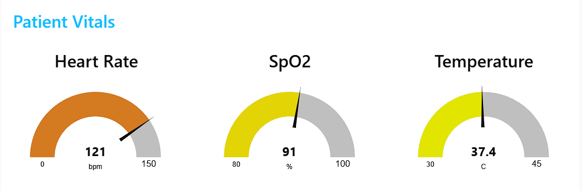
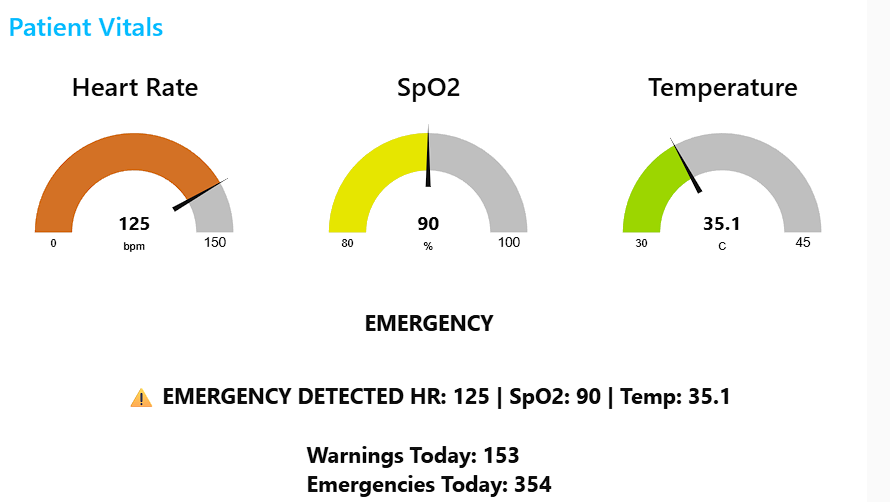
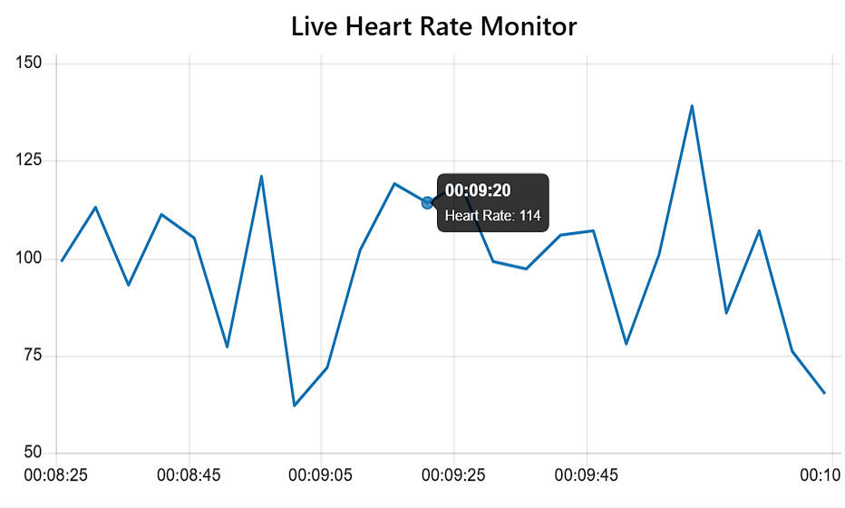

# 💖 ElderEase – Phase 1  
## Real-Time Rule-Based Senior Health Monitoring System  


---

# 📄 Abstract

ElderEase is a modular, real-time health monitoring system designed to simulate and analyze vital health parameters of elderly individuals.  

Phase 1 establishes a rule-based monitoring architecture using Node-RED, enabling structured health data simulation, validation, classification, and logging.  

The system follows an event-driven, flow-based design and is built entirely using open-source technologies to ensure FOSS compliance.  

This phase serves as the foundational layer for future expansions including database integration, full-stack web dashboards, and machine learning-based predictive analytics.

---

# 🎯 Problem Statement

Elderly individuals living independently face significant health risks such as:

- Sudden heart rate spikes  
- Low oxygen saturation  
- Fever episodes  
- Lack of continuous monitoring  

Most existing systems are reactive and hardware-dependent. ElderEase aims to create a scalable monitoring architecture starting with a simulated real-time pipeline.

---

# 🏗️ System Architecture (Phase 1)

```
[ Vital Data Simulation Module ]
↓
[ Data Validation Module ]
↓
[ Decision Engine Module ]
↓
[ Monitoring & Logging Module ]
↓
[ Emergency Detection Module ]
↓
[ Real-Time Dashboard Module ]
```

Architecture Characteristics:

* Event-driven system
* Flow-based programming model
* Modular layered design
* Scalable for database & ML integration


---

# 🛠️ Tech Stack (Phase 1)

| Layer | Technology | Purpose |
|--------|------------|----------|
| Runtime | Node.js | Runs Node-RED |
| Core Engine | Node-RED | Flow-based processing |
| Programming | JavaScript | Logic implementation |
| Data Format | JSON | Structured message passing |
| UI (Planned) | node-red-dashboard | Real-time monitoring UI |
| Logging | Node-RED context | Local system metrics |
| Version Control | Git + GitHub | Continuous commits |

All tools used are open-source.

---

## 🔧 Node-RED Setup

1. Install Node.js (v18+ recommended)
2. Install Node-RED:
   npm install -g --unsafe-perm node-red
3. Start Node-RED:
   node-red
4. Open: http://localhost:1880

### 📸 Node-RED Welcome Screen



### 📸 Node-RED Editor Interface



---
# 📦 Module Breakdown

---

## 🔹 1. Vital Data Simulation Module

Simulates real-time wearable sensor data.

Generated Fields:

- `userId`
- `deviceId`
- `heartRate`
- `spo2`
- `temperature`
- `timestamp`
- `systemVersion`

Example Output:

```
{
  "userId": "ELD001",
  "deviceId": "SIM001",
  "heartRate": 87,
  "spo2": 96,
  "temperature": 36.8,
  "timestamp": "2026-03-01T14:00:00",
  "systemVersion": "v1.0"
}
```

### 📸 Live Simulation Output

The following screenshot shows real-time vital data being generated every 5 seconds using the simulation module.



---

## 🔹 2. Data Validation Module

The **Data Validation Module** ensures that all simulated health readings fall within realistic physiological ranges before further processing.

### Validation Ranges

- **Heart Rate:** 40–180 bpm  
- **SpO₂:** 70–100 %  
- **Temperature:** 34–42 °C  

### Functionality

- Verifies each incoming reading.
- Flags invalid or out-of-range values.
- Logs invalid readings for monitoring.
- Appends `valid` and `error` fields.
- Preserves structured payload integrity.
- Prevents corrupted data from entering the decision engine.

### Example (Invalid Flagged Output)

```
{
  "heartRate": 220,
  "spo2": 95,
  "temperature": 36.9,
  "valid": false,
  "error": "Heart Rate out of realistic range"
}
```

📸 Live Validation Output


---

## 🔹 3. Decision Engine Module

The **Decision Engine Module** performs rule-based classification of validated health readings.

It analyzes processed data and determines the real-time health status of the monitored individual.

---

### 📊 Status Categories

- NORMAL
- WARNING
- EMERGENCY

---

### ⚙️ Rule Logic (Phase 1)

- heartRate > 110 → EMERGENCY
- spo2 < 90 → EMERGENCY
- temperature > 38°C → EMERGENCY
- Borderline conditions → WARNING
- Otherwise → NORMAL

---

### 🧠 Decision Output Structure

```json
{
  "status": "EMERGENCY",
  "reason": "Low Oxygen Level",
  "riskLevel": 3,
  "timestamp": "2026-03-01T14:00:00"
}
```

### 🚦 Risk Level Mapping

| Risk Level | Status |
|------------|---------|
| 1 | NORMAL |
| 2 | WARNING |
| 3 | EMERGENCY |

---

### 🔮 Design Advantages

- Clear separation of validation and classification logic
- Easy rule modification
- Expandable to ML-based prediction models
- Compatible with database persistence in Phase 2

📸 Decision Engine Output



---

## 🔹 4. Monitoring & Logging Module

The **Monitoring & Logging Module** enhances system transparency, reliability, and observability.

It tracks system-level metrics and emergency events for operational monitoring.

---

### 📈 Metrics Tracked

- Total readings processed
- Emergency event count
- Last emergency timestamp
- Recent reading history (last N records)

---

### 💾 Storage Mechanism

- Uses Node-RED flow/global context storage
- Maintains temporary in-memory logs
- No external database dependency (Phase 1)
- Structured for future database integration

---

### 📝 Example Logged Record

```json
{
  "timestamp": "2026-03-01T14:00:00",
  "status": "EMERGENCY",
  "reason": "High Heart Rate",
  "riskLevel": 3
}
```

---

### ✅ Architectural Benefits

- Improves system reliability
- Enables audit-style monitoring
- Makes prototype production-ready
- Simplifies transition to persistent storage

---

## 🔹 5. Manual Emergency Injection

Testing capability for controlled demo scenarios.

### 🎯 Supported Simulations

- Simulate High Heart Rate
- Simulate Low SpO₂
- Simulate Fever

Allows controlled validation of the Decision Engine and edge-case testing without modifying core simulation logic.

### 📸 Manual Emergency Simulation
Manual injection nodes allow testing emergency conditions instantly.


---

## 🔹 6. Real-Time Dashboard Module

The **Dashboard Module** provides live visualization of simulated health data using `node-red-dashboard`.

It operates as a dedicated UI layer, separated from core simulation and decision logic.

### 🖥️ Dashboard Features

* Real-time **Heart Rate Gauge**
* Real-time **SpO₂ Gauge**
* Real-time **Temperature Gauge**
* **Color-coded Health Status Indicator**
* **Emergency Alert Display**
* **Daily Health Summary Counter**
* **Live Heart Rate Monitoring Chart**
* **Manual Emergency Simulation Controls**

### 🔄 Data Flow for Dashboard

```
Vital Simulation Module
↓
Extract Heart Rate Function
↓
Heart Rate Gauge (UI)
```

### 📸 Live Dashboard Output
The screenshot below demonstrates the real-time dashboard updating dynamically based on simulated vital data.



### 📸 Vital Monitoring Dashboard
The dashboard displays real-time vital health parameters through interactive gauges.



---

## 🔹 7. Emergency Alert Module

The **Emergency Alert Module** detects abnormal health conditions classified by the Decision Engine and generates visual alerts on the monitoring dashboard.

### Features

* Detects **EMERGENCY** health states
* Displays alert messages with vital details
* Enables rapid identification of critical conditions
* Designed for future integration with notification services

### Example Alert

```
⚠ EMERGENCY DETECTED
HR: 121 | SpO₂: 86 | Temp: 37.3
```

### 📸 Emergency Alert Display
The dashboard immediately highlights critical health events when abnormal vitals are detected.



---

## 🔹 8. Daily Health Summary Module

Tracks system activity and health events during runtime.

### Metrics Displayed

* Total warnings detected
* Total emergency events
* Continuous monitoring statistics

### Example Summary

```
Warnings Today: 87
Emergencies Today: 212
```

---

## 📊 JSON Schema (Phase 1)

```json
{
  "userId": "string",
  "deviceId": "string",
  "heartRate": "number",
  "spo2": "number",
  "temperature": "number",
  "status": "string",
  "reason": "string",
  "riskLevel": "number",
  "timestamp": "ISO Date",
  "systemVersion": "string"
}
```

Designed with structured extensibility for database persistence and ML-based analytics in future phases.

### 📸 Daily Health Monitoring Summary
The system tracks warning and emergency events during runtime.


---

## 🔹 9. Live Vital Monitoring Chart

A **real-time line chart** visualizes heart rate fluctuations over time.

### Capabilities

* Displays last N heart rate readings
* Updates automatically every 5 seconds
* Provides trend visualization for patient monitoring

### Example Visualization

```
Heart Rate Trend Over Time
```

### 📸 Live Heart Rate Monitoring Chart
The chart visualizes heart rate trends over time for continuous monitoring.



--- 

## 🧪 Testing Strategy

| Test Case | Input | Expected Output |
|------------|--------|----------------|
| Normal HR | 85 bpm | NORMAL |
| High HR | 125 bpm | EMERGENCY |
| Low SpO₂ | 82 % | EMERGENCY |
| High Temp | 39 °C | EMERGENCY |

Manual inject nodes validate all boundary and emergency conditions.

---
---

# 👥 Project Members & Responsibilities

ElderEase Phase 1 is being developed collaboratively with clearly defined module ownership to ensure modular architecture and consistent progress.

---

## 🔹 Aadya Patel  
**Role:** Data & Simulation Lead  

### Primary Responsibilities:
- Design and implement the Vital Data Simulation Module  
- Generate realistic heart rate, SpO₂, and temperature values  
- Define and maintain structured JSON schema  
- Implement Data Validation logic  
- Maintain payload consistency and metadata (timestamp, deviceId, versioning)

### Secondary Contributions:
- Assist in architecture design  
- Support integration between modules  

---

## 🔹 Ananya Mishra  
**Role:** Logic & Monitoring Lead  

### Primary Responsibilities:
- Design and implement the Decision Engine Module  
- Develop rule-based health classification logic (NORMAL / WARNING / EMERGENCY)  
- Implement riskLevel mapping system  
- Build Monitoring & Logging Module  
- Track system metrics (emergency count, last emergency, total readings)

### Secondary Contributions:
- Optimize rule logic  
- Ensure clean separation between validation and classification layers  

---

## 🔹 Anish Kushwaha  
**Role:** UI & Documentation Lead  

### Primary Responsibilities:
- Design and implement Dashboard layout (Phase 1 UI integration)  
- Structure flow grouping and visual organization in Node-RED  
- Maintain and update README documentation  
- Create architecture diagrams and weekly progress reports  
- Ensure FOSS compliance documentation  

### Secondary Contributions:
- Support logging display and visualization features  
- Maintain repository structure and commit consistency  

---

## 🤝 Collaboration Model

- Each module is developed independently but integrated through structured JSON payloads.
- Weekly reviews ensure architectural consistency.
- All members contribute commits regularly following conventional commit standards.

---

## 🚀 Development Roadmap

### Phase 1 (Current)

- Simulation
- Validation
- Rule-based classification
- Logging
- Basic dashboard

### Phase 2

- Express backend API
- MongoDB integration
- Persistent health history

### Phase 3

- React dashboard
- Authentication system
- Role-based access control

### Phase 4

- Machine Learning prediction
- Anomaly detection
- Predictive health scoring

---

## 📈 Weekly Progress Tracking

### Week 1 (Completed)

✔ Implemented real-time vital simulation module  
✔ Added structured JSON payload with ISO timestamp  
✔ Configured 5-second automated data trigger  
✔ Integrated Node-RED dashboard for live visualization  
✔ Implemented Extract Heart Rate UI processing layer  
✔ Deployed real-time heart rate gauge interface  

### Week 2 (Completed)

✔ Implemented multi-vital dashboard with gauges
✔ Added SpO₂ and Temperature monitoring visualization
✔ Implemented color-coded health status indicator
✔ Built emergency alert detection and display system
✔ Added daily health summary counter
✔ Implemented manual emergency simulation controls
✔ Integrated live heart rate monitoring chart
✔ Refactored dashboard architecture for modular UI components

---

## 🔐 FOSS Compliance

- No proprietary APIs
- No paid services
- Fully local execution
- Built entirely on open-source technologies

---

## 📜 License

This project is licensed under the MIT License.

MIT License

Copyright (c) 2026 ElderEase

Permission is hereby granted, free of charge, to any person obtaining a copy  
of this software and associated documentation files (the "Software"), to deal  
in the Software without restriction, including without limitation the rights  
to use, copy, modify, merge, publish, distribute, sublicense, and/or sell  
copies of the Software...

(Full MIT License text can be placed in a separate `LICENSE` file.)

---

## 🌱 Future Vision

ElderEase aims to evolve into a predictive, scalable elderly healthcare monitoring ecosystem integrating IoT, full-stack architecture, and machine learning.

---

## 💬 Vision Statement

Building a structured, scalable foundation for intelligent senior health monitoring — one module at a time.

